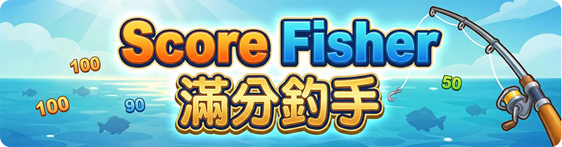
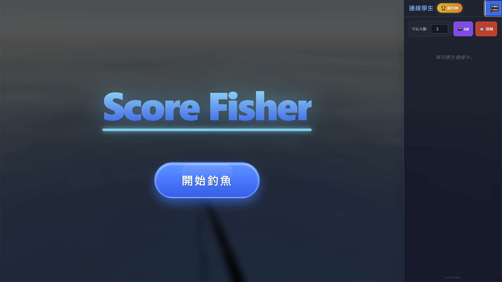
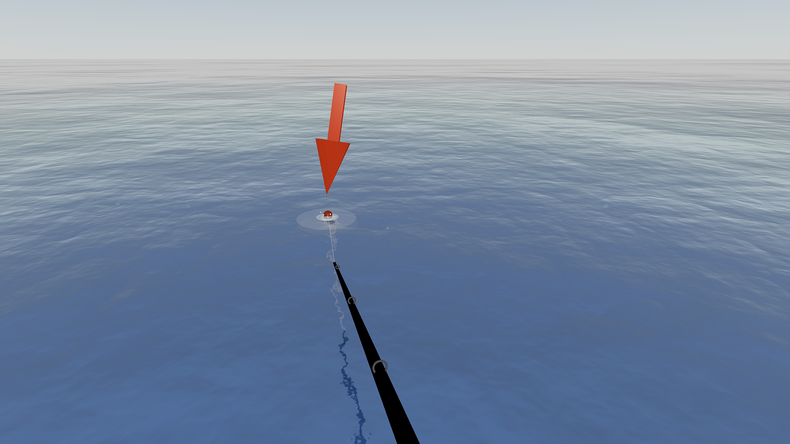
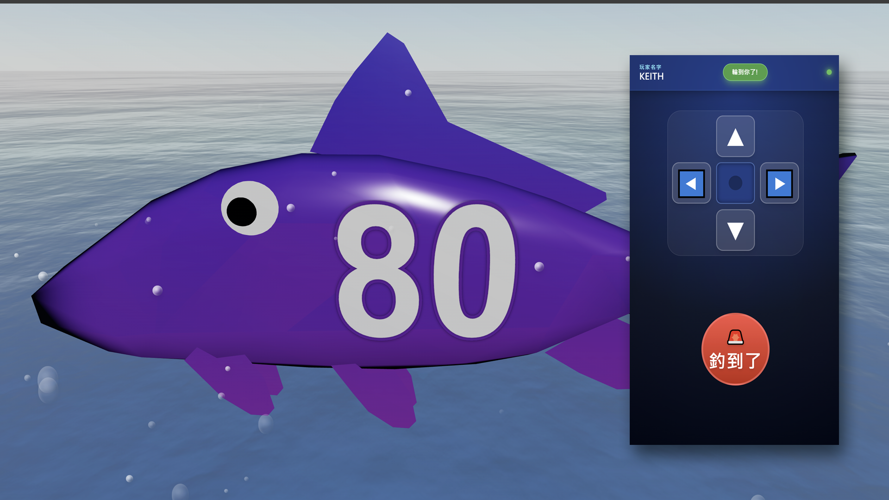
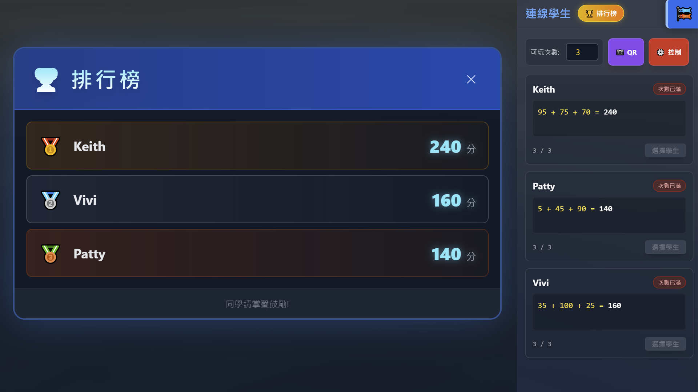

<div align="center">


## 滿分釣手 Score Fisher

**滿分釣手** 是一款互動式的課堂遊戲，將教室和線上課堂變成一個巨大的釣魚場<br> 
 老師透過電腦瀏覽器顯示 3D 釣魚畫面，學生則使用自己的手機作為釣竿控制器。<br>
 100% HTML 老師可以上課前本機修改不同課程需要的內容，並立即在瀏覽器執行。  
</div>

## 📸 遊戲實際畫面

<div align="center">
  
  
</div>
<div align="center">
  
  
</div>

## 🌐 線上展示

您可以直接點擊以下連結進行體驗，無需安裝任何軟體：

* [**👨‍🏫 老師端 (遊戲主畫面)**](https://scorefisher.onrender.com/admin.html)
    > 建議使用 **電腦瀏覽器** 開啟，並投影至大螢幕或Google Meet投放視窗。

* [**📱 學生端 (手機控制器)**](https://scorefisher.onrender.com)
    > 請使用 **手機、平板瀏覽器** 開啟，以獲得最佳的體感體驗。

## 🌟 系統架構 (運作原理)

本專案採用 **混合式架構**，讓老師能最方便地自定義題目，同時確保連線穩定：

1.  **雲端伺服器 (Render)**：負責處理連線訊號 (`wss://scorefisher.onrender.com`)。
2.  **學生端 (GitHub Pages)**：學生透過手機瀏覽器開啟網頁控制器。
3.  **老師端 (可下載至本機檔案)**：100%HTML，老師直接在電腦打開 `admin.html`，可隨時用記事本修改題目，存檔即更新。

---

## 🚀 老師使用指南 (快速開始)

### 步驟 1：開啟遊戲
1.  確保電腦已連上網際網路（因為需要載入 3D 引擎與連線到雲端伺服器）。
2.  不需要安裝任何程式，直接雙擊資料夾中的 **`admin.html`** 開啟。
3.  將瀏覽器畫面投影到教室大螢幕或是Google Meet。
4.  側拉開啟選單，可設定每人釣魚次數，開啟QRCODE，奪回控制權
5.  分數會自動加總，開啟排行榜可看到本次所有學生的得分與排名

### 步驟 2：學生連線
1.  點擊畫面右側選單的 **「📷 QR」** 按鈕。
2.  請學生拿出手機掃描螢幕上的 QR Code。
3.  學生手機將進入控制器畫面，輸入名字後點擊連線。
4.  當學生出現在右側列表後，老師點擊 **「選擇學生」** 即可讓該名學生開始釣魚。

### 步驟 3：如何修改題目 (自定義單字/分數)
老師不需要懂程式設計，只需使用記事本即可修改釣起的內容。

1.  對著 `admin.html` 點擊滑鼠右鍵，選擇「以記事本開啟」或「使用 VS Code 開啟」。
2.  搜尋關鍵字 **`WORD_LIST`** 。
3.  修改括號內的內容，如下範例：

```javascript
// ==========================================
// 自定義題目區
// ==========================================
const SCORE_PER_LETTER = 10; // 每個字的預設分數

const WORD_LIST = [
    // 在這裡填入您想讓學生釣到的單字或分數
    // 請用英文雙引號 "" 包起來，並用逗號 , 隔開
    
    "Apple", "Banana", "Cat", "Dog", "Elephant",
    "100", "Try Again", "Bonus"
];
```

4.  修改完成後存檔 (`Ctrl+S`)。
5.  回到瀏覽器，**重新整理** `admin.html` 頁面，新題目就會立即生效！

---

## 🚀 部署指南 (初次設定必讀)

⚠️ **重要提示：請務必建立自己的伺服器，否則會接收到其他班級的訊號！**

### 第一步：部署專屬伺服器 (Render)
我們使用 Render.com 的免費方案來架設 WebSocket 伺服器。

1.  **準備程式碼**：將本專案的 `server.js` 與 `package.json` 上傳至您的 GitHub 儲存庫 (Repository)。
2.  **註冊/登入 Render**：前往 [Render.com](https://render.com/) 並使用 GitHub 帳號登入。
3.  **建立服務**：
    * 點擊 **New +** -> 選擇 **Web Service**。
    * 選擇您剛剛上傳的 GitHub 儲存庫。
4.  **設定參數** (請依照下方填寫)：
    * **Name**: 取個喜歡的名字 (例如 `my-fishing-class-801`)。
    * **Region**: 內定即可。
    * **Runtime**: 選擇 `Node`。
    * **Build Command**: 填入 `npm install`。
    * **Start Command**: 填入 `node server.js`。
    * **Instance Type**: 選擇 `Free` (免費版)。
5.  **取得網址**：部署完成後，Render 會給您一個網址，格式為 `https://xxxx.onrender.com`。
    * **請記下這個網址，我們稱為 `[伺服器網址]`。**

### 第二步：設定遊戲檔案
有了專屬伺服器後，需要告訴遊戲去連線哪裡。

1.  **修改老師端 (`admin.html`)**：
    * 用記事本開啟 `admin.html`。
    * 搜尋 `WS_URL`。
    * 將網址改為：`wss://[您的伺服器網址無https://]` (注意開頭是 **wss://**)
      * 例如：`wss://my-fishing-class-801.onrender.com`

2.  **修改學生端 (`index.html`)**：
    * 用記事本開啟 `index.html`。
    * 同樣搜尋 `WS_URL` 並修改為您的 wss 網址。
    * 儲存後，將 `index.html` 上傳至 **GitHub Pages** 供學生連線。

3.  **更新 QR Code**：
    * 在 `admin.html` 中搜尋 `api.qrserver.com`。
    * 將後面的網址改為您學生端 (GitHub Pages) 的網址，這樣學生掃描後才會連到對的地方。

---

## 🎮 老師使用指南 (日常上課)

設定完成後，以後上課只需以下步驟：

1.  **開啟遊戲**：直接雙擊電腦中的 `admin.html` (需連網)。
2.  **修改題目**：
    * 用記事本開啟 `admin.html`。
    * 搜尋 `WORD_LIST` 修改題目或分數。
    * 存檔後重新整理網頁即可生效。
3.  **學生連線**：
    * 點擊右側選單「📷 QR」。
    * 學生掃描連線，輸入名字。
    * 老師點擊「選擇學生」開始遊戲。

---

## ⚠️ 常見問題排除

* **Q: 為什麼學生連線後一直顯示「斷線」？**
    * A: 請檢查 Render 伺服器是否進入休眠。免費版 Render 若一段時間無人使用會自動休眠，重新連線約需等待 1-2 分鐘喚醒。建議上課前先打開網頁喚醒它。
    
* **Q: 手機無法震動？**
    * A: iOS (iPhone) 需要使用者點擊螢幕任意處後才會觸發震動權限。請確認手機未開啟「勿擾模式」。

* **Q: 畫面操作有延遲？**
    * A: 請確認教室網路環境。若使用手機 4G/5G 訊號通常比學校共用 Wi-Fi 穩定。